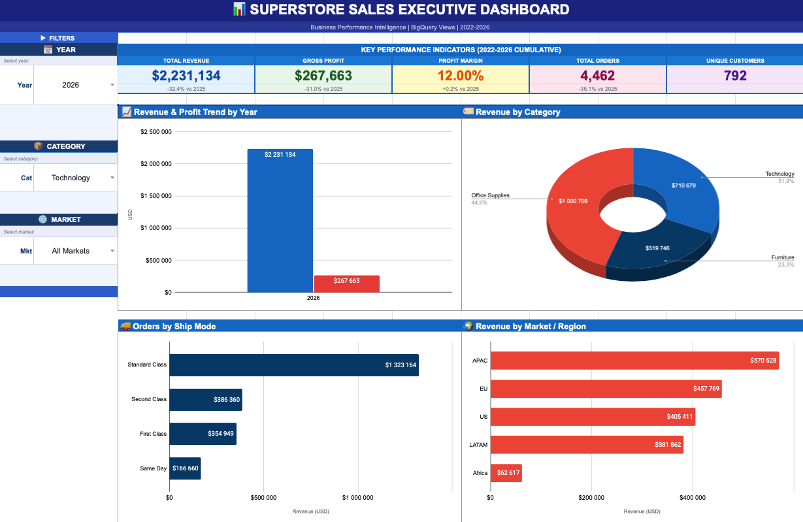

# Superstore Global Sales Executive Dashboard

An executive-level sales analytics dashboard built on **BigQuery + Google Sheets Connected DataSources + Google Apps Script**. The project demonstrates end-to-end analytics engineering: eight BigQuery SQL views feed live Connected DataSource sheets, a 1,203-line Apps Script orchestration layer computes filter-adjusted KPI aggregates, writes to hidden helper tables consumed by embedded charts, and updates year-over-year comparison strings — all within seconds of a filter change.

> **This is not a simple spreadsheet with charts.** It implements a full data pipeline:
> BigQuery warehouse → Connected DataSources → Apps Script orchestration → helper table architecture → dynamic KPI cards and charts.

---

## Dashboard Screenshot



---

## Live Dashboard

[Open the live dashboard](https://docs.google.com/spreadsheets/d/1KCHSehYeouF4RoChLFqeGKlLtMb5veQ9MMmQ24jjqjE/edit?usp=sharing)

---

## Business Problem

Global retail leadership needs a single view of sales performance across five markets (APAC, EU, US, LATAM, Africa), three product categories, and five years — with immediate year-over-year context for every metric. The solution had to:

- Surface live data without manual exports or ETL pipelines
- Respond to filter changes instantly with updated KPIs and charts
- Run entirely within Google Workspace with no external infrastructure
- Deliver executive-grade formatting (`+13.0% vs 2024`, not raw numbers)

---

## Live Features

- **4 KPI cards** — Revenue, Profit, Margin %, Orders — each showing current period value plus a dynamically computed YoY comparison (`+13.0% vs 2024`)
- **5 embedded charts** — Annual revenue/profit trend, category breakdown, market breakdown, shipping mode split, annual performance table
- **3 interactive filters** — Year, Category, Market — available both as inline DASHBOARD dropdowns and on a dedicated Controls sheet, with full bidirectional sync
- **Automatic refresh** — installable `onEdit` trigger fires on every filter change; no manual refresh button required
- **Custom Sheets menu** — "Dashboard" top-level menu for manual refresh, setup, and trigger installation

---

## Technical Stack

| Layer | Technology |
|-------|------------|
| Data Warehouse | Google BigQuery |
| Data Transport | Google Sheets Connected DataSources (8 live BigQuery views) |
| Orchestration | Google Apps Script (27 functions, ~1,203 lines) |
| Presentation | Google Sheets — DASHBOARD sheet |
| Trigger | Apps Script installable `onEdit` trigger |

---

## Architecture Overview

```
BigQuery SQL Views (8)
│  live query on Sheets open
▼
v_rpt_* DataSource Sheets (read-only)
│  Apps Script reads via getRange().getValues()
▼
Hardcoded Reference Data in Apps Script
(REF_YEAR / REF_CAT / REF_MKT / REF_SHIP)
│  filter logic applied in memory
▼
In-Memory Computation (JavaScript)
│  scale factors + exact year aggregation
▼
Helper Tables  ─────────────────►  Embedded Charts (auto-update)
(DASHBOARD col N, hidden)
│
▼
KPI Cards (rows 6–7)
Row 6: formatted values  ($3.3M / $387K / 11.75% / 6,870)
Row 7: YoY comparisons   (+13.0% vs 2024)
```

Full architecture details: [`docs/architecture.md`](docs/architecture.md)

---

## Data Flow

On file open, all eight Connected DataSource sheets query their BigQuery views simultaneously. When a user changes a filter dropdown, the installable `onEdit` trigger fires:

1. `getFilters()` reads both control locations (DASHBOARD + Controls sheet), syncs them, and returns a normalised filter object
2. Scale factors are computed for the selected categories and markets
3. Builder functions (`buildHT1`–`buildHT4`, `buildKPIs`, `buildPerfTable`) compute aggregates in memory
4. `writeHelperTables()` batch-writes results to five fixed ranges in DASHBOARD column N
5. `updateKPICards()` writes formatted values and YoY comparison strings to rows 6–7
6. Embedded charts auto-render from their statically bound column N ranges

Full data flow with traced filter examples: [`docs/data_flow.md`](docs/data_flow.md)

---

## Repository Structure

```
/
├── README.md
├── apps_script/
│   └── final_dashboard_script.gs     ← Apps Script source (~1,203 lines, 27 functions)
├── docs/
│   ├── architecture.md               ← System architecture, components, function reference
│   ├── technical_implementation.md   ← Implementation decisions, constraints, solutions
│   ├── data_flow.md                  ← End-to-end data flow with traced filter examples
│   ├── architecture_decisions.md     ← 7 major decisions with problem/constraint/solution/trade-offs
│   └── interview_talking_points.md   ← Interview prep and talking points
├── sql/
│   ├── v_rpt_exec_summary.sql        ← Annual KPIs + YoY growth rates
│   ├── v_rpt_monthly_trend.sql       ← Monthly time series + YTD + MoM
│   ├── v_rpt_category.sql            ← Category/sub-category breakdown + margin tiers
│   ├── v_rpt_discount.sql            ← Discount tier profitability + loss rate
│   ├── v_rpt_market_geo.sql          ← Geographic/market breakdown + shipping
│   ├── v_rpt_customer.sql            ← Customer segmentation (template)
│   ├── v_rpt_product.sql             ← Product performance (template)
│   └── v_rpt_shipping.sql            ← Shipping mode analysis + delivery times
├── screenshots/
│   └── dashboard.png
└── assets/
```

---

## Setup Instructions

### Prerequisites

- Google Workspace account with access to Google Sheets and Google BigQuery
- A BigQuery dataset containing Superstore order-level data with the staging view `v_stg_superstore`

### Step 1 — Create BigQuery Views

Run each `.sql` file in `/sql/` against your BigQuery dataset to create the eight reporting views. Update the dataset reference (`plasma-origin-497414-f2.superstore_sales`) to match your project.

```sql
-- Example: run in BigQuery console or via bq CLI
bq query --use_legacy_sql=false < sql/v_rpt_exec_summary.sql
```

### Step 2 — Connect Views to Google Sheets

For each `v_rpt_*` view:
1. Open the Google Spreadsheet
2. **Data → Data connectors → Connect to BigQuery**
3. Select your project and the view name
4. Name each tab to exactly match the view name (e.g., `v_rpt_exec_summary`)

### Step 3 — Add the Apps Script

1. Open the spreadsheet → **Extensions → Apps Script**
2. Replace the default `Code.gs` content with the contents of `/apps_script/final_dashboard_script.gs`
3. Save (`Ctrl+S`)

### Step 4 — Run One-Time Setup

In the Apps Script editor:
1. Select `setupDashboard` from the function dropdown → click **Run**
2. Select `installTrigger` → click **Run** (this registers the `onEdit` trigger once)
3. Grant the requested OAuth permissions when prompted

### Step 5 — Use the Dashboard

Open the spreadsheet. Use the Year / Category / Market dropdowns on the DASHBOARD sheet or the Controls sheet. The dashboard refreshes automatically on every filter change.

---

## Key Architecture Decisions

Seven major design decisions shaped this project. Full rationale for each — including problem, constraint, alternatives considered, and trade-offs — is documented in [`docs/architecture_decisions.md`](docs/architecture_decisions.md).

| Decision | Approach | Key Trade-off |
|----------|----------|---------------|
| Data transport | Connected DataSources (live BigQuery link) | Read-only DataSource sheets — cannot be written to or rearranged |
| Reference data | Hardcoded marginal totals in JS constants | Fast and reliable; requires one-time update if a new year/market is added |
| Chart data | Hidden helper tables in DASHBOARD column N | Clean separation of raw data / aggregates / charts; no chart rebuilds needed |
| Category/market filtering | Proportional scaling by revenue fraction | Directionally accurate for executive use; assumes stable mix year-over-year |
| KPI comparisons | Dynamic YoY: prior year inherits same cat/mkt filters | Respects all active filters; comparison period always matches the current view |
| Filter controls | Dual UI with bidirectional sync | Either surface can change filters; minor overhead per refresh cycle |
| Trigger type | Installable `onEdit` (not simple `onEdit`) | Full OAuth permissions for cross-sheet operations; requires one-time installation |

---

## Technical Highlights

- **Window functions in BigQuery views:** `LAG()` for YoY growth, `SUM() OVER (PARTITION BY order_year ORDER BY order_month)` for YTD, `RANK()` for within-year rankings, `SAFE_DIVIDE()` for zero-safe margin calculations
- **Two filtering strategies, one function signature:** Year filtering iterates `REF_YEAR` directly (exact); category/market applies revenue proportion scale factors (documented approximation). Every `buildHT*` function comments its own strategy
- **CFG object:** All magic strings (sheet names, cell addresses, dimension arrays) centralised in one configuration object — zero hardcoded strings in logic functions
- **Batch writes:** `writeHelperTables()` calls `setValues()` five times in one round trip, not one write per cell
- **Margin as percentage points, not percentage change:** `updateKPICards()` uses delta (`currentMargin% - priorMargin%`) for the margin KPI, matching financial reporting convention

---

## Limitations and Trade-offs

**Proportional scaling for category/market filters**
Category and market filtering is an approximation. When you select "Technology only," KPI values are estimated by multiplying year totals by Technology's share of overall revenue (~32%). If Technology's revenue mix varies significantly year-over-year, these estimates diverge from exact filtered BigQuery values. For executive trend monitoring, this is fit for purpose. For operational dashboards requiring exact per-filter counts, a cross-dimensional reference table or runtime BigQuery API calls would be needed.

**Static reference data**
`REF_YEAR`, `REF_CAT`, and `REF_MKT` are hardcoded in the Apps Script. If a new year's orders are added to BigQuery, the constants must be updated manually. The dataset's 5-year planning horizon makes this trade-off acceptable.

**Connected DataSource read constraints**
`getDataRange().getValues()` is not supported on DataSource sheets. Only explicit fixed-range reads work, and only when the sheet has finished loading. This is why aggregates are pre-computed in the script constants rather than read at runtime.

**Google Workspace dependency**
The entire solution runs inside Google Workspace. It cannot be deployed independently and requires the installing user to grant OAuth permissions for the trigger to function.

---

## Future Improvements

- **Cross-dimensional reference table** (`REF_YEAR_CAT_MKT`) — 75 entries covering all year × category × market combinations — would make category and market filtering fully exact with no architectural change
- **BigQuery UrlFetch integration** — runtime parameterised queries from Apps Script would provide exact results for any filter combination, at the cost of latency and credential management
- **Scheduled reference data refresh** — a time-driven trigger that reads the DataSource sheets on a nightly basis and updates the reference constants automatically
- **Additional views** — `v_rpt_customer` (customer lifetime value, segment analysis) and `v_rpt_product` (SKU-level performance, loss-making products) are defined in `/sql/` and ready to connect

---

## Data

| Attribute | Detail |
|-----------|--------|
| Period | 2022–2026 (5 years) |
| Markets | APAC, EU, US, LATAM, Africa |
| Categories | Technology, Furniture, Office Supplies |
| Ship modes | Standard Class, Second Class, First Class, Same Day |
| Total revenue | $12,642,905 |
| Total orders | ~25,465 |
| Source | Superstore Global dataset (order-level) |

---

## Portfolio Positioning

**Short description for GitHub / LinkedIn:**
> Executive sales dashboard built with BigQuery Connected Sheets and Google Apps Script automation — featuring helper tables, event-driven refresh, dynamic KPI cards, and filter-aware YoY calculations.

**What this demonstrates:**
- Analytics engineering (BigQuery SQL with window functions, multi-view architecture)
- Orchestration layer design (Apps Script as a proper automation engine, not macros)
- Platform constraint problem-solving (Connected DataSource limitations → hardcoded constants + proportional scaling)
- Documentation discipline (architecture decisions, data flow, technical implementation, trade-offs)

